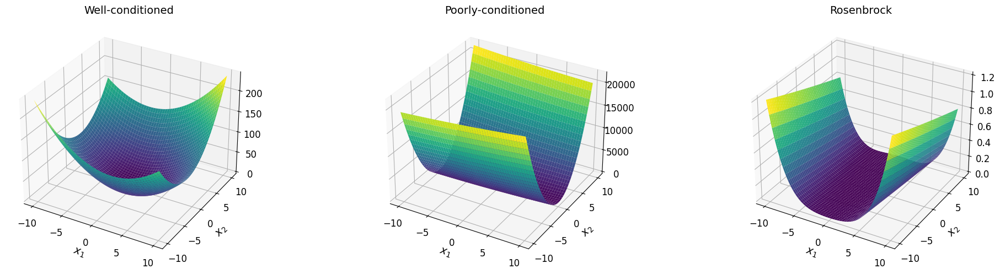
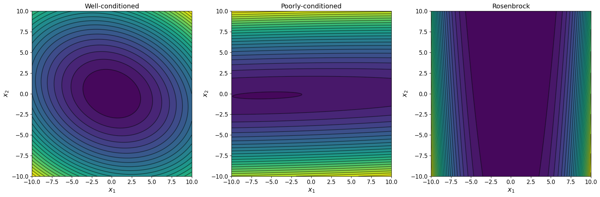

# Классический градиентный спуск

## Рассматриваемые функции
Исследование выполнено в следующих функциях:
- хорошо обусловленная (µ ≃ 1) двумерная квадратичная функция;
- плохо обусловленная (µ > 10) двумерная квадратичная функция;
- функция Розенброка.

## Результаты исследования

- [Градиентный спуск с постоянным шагом](const_step_descent.md)
- [Градиентный спуск с дроблением шага по условию Армихо](armijo_step_descent.md)
- [Наискорейший спуск с одномерным поиском методом золотого сечения](steepest_descent.md)
- [Траектории методов на графике линий уровня](trajectories.md)

# Выводы
- Все 3 метода быстро сходятся в случае минимизации "хорошей" функции.
- В случае градиентного спуска с постоянным шагом вычисление функции вообще не требуется. Вычисляются только градиент и его норма.
- Градиентный спуск с дроблением шага по условию Армихо показал себя как наиболее эффективный. Вообще не капризный.

# Справка
## Квадратичная функция двух аргументов

$$\begin{equation}
    f(x_1, x_2) = a_{11} x_1^2 + (a_{12} + a_{21}) x_1 x_2 + a_{22} x_2^2 + b_1 x_1 + b_2 x_2 + c
\end{equation}$$

в векторной форме записи:

$$\begin{equation}
    f(x_1, x_2) = \vec{x} A \vec{x} + B \vec{x} + c,
\end{equation}$$

где $A$ − квадратная матрица размера $N=2$,

$$\begin{equation}
   b = [b_1, b_2],
\end{equation}$$

$$\begin{equation}
   \vec{x} = [x_1, x_2]
\end{equation}$$

$c$ − вещественное число.

## Функция Розенброка

$$\begin{equation}
    f(x_1, x_2) = (a - x_1)^2 + b (x_2 - x_1^2)^2.
\end{equation}$$

Минимум функции имеет место при ${(x_1, x_2)=(a, a^2)}$, причем ${f(a, a^2) = 0}$.

В большинстве случаев принимают ${a = 1}$, ${b = 100}$. Тогда минимум функции расположен в точке ${(1, 1)}$.