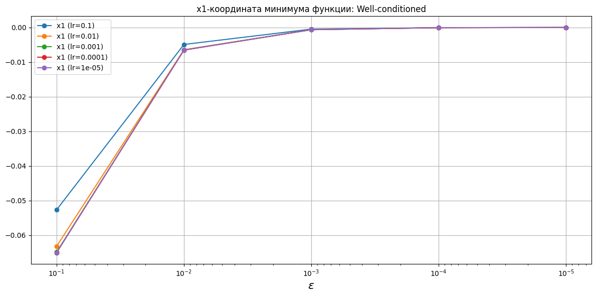

# Градиентный спуск с постоянным шагом

В качестве критерия останова принята норма градиента.

<!-- START_X_OPTIM_WELL-CONDITIONED --> 
### Координаты минимума функции: Well-conditioned
|    eps |   x1 (lr=0.1) |   x2 (lr=0.1) |   x1 (lr=0.01) |   x2 (lr=0.01) |   x1 (lr=0.001) |   x2 (lr=0.001) |   x1 (lr=0.0001) |   x2 (lr=0.0001) |   x1 (lr=1e-05) |   x2 (lr=1e-05) |
|-------:|--------------:|--------------:|---------------:|---------------:|----------------:|----------------:|-----------------:|-----------------:|----------------:|----------------:|
| 0.1    |   0.0472178   |  -0.0201369   |    0.0624272   |   -0.0273948   |     0.0636548   |    -0.0280155   |      0.0637595   |     -0.0280694   |     0.0637745   |    -0.0280769   |
| 0.01   |   0.00542494  |  -0.0022562   |    0.00632313  |   -0.00264377  |     0.0064162   |    -0.00268444  |      0.00643006  |     -0.00269043  |     0.00643144  |    -0.00269103  |
| 0.001  |   0.000532175 |  -0.000220541 |    0.000627416 |   -0.000260269 |     0.000642601 |    -0.000266608 |      0.000643843 |     -0.000267128 |     0.000643958 |    -0.000267176 |
| 0.0001 |   5.21811e-05 |  -2.16154e-05 |    6.30999e-05 |   -2.6143e-05  |     6.42918e-05 |    -2.66376e-05 |      6.43918e-05 |     -2.66791e-05 |     6.44083e-05 |    -2.66859e-05 |
| 1e-05  |   5.11621e-06 |  -2.11922e-06 |    6.34504e-06 |   -2.6283e-06  |     6.43127e-06 |    -2.66403e-06 |      6.43977e-06 |     -2.66756e-06 |     6.44108e-06 |    -2.6681e-06  |
<!-- END_X_OPTIM_WELL-CONDITIONED -->
<!-- START_X_OPTIM_POORLY-CONDITIONED --> 
### Координаты минимума функции: Poorly-conditioned
|    eps |   x1 (lr=0.0001) |   x2 (lr=0.0001) |   x1 (lr=8e-05) |   x2 (lr=8e-05) |   x1 (lr=6e-05) |   x2 (lr=6e-05) |   x1 (lr=4e-05) |   x2 (lr=4e-05) |   x1 (lr=2e-05) |   x2 (lr=2e-05) |
|-------:|-----------------:|-----------------:|----------------:|----------------:|----------------:|----------------:|----------------:|----------------:|----------------:|----------------:|
| 0.1    |         -5.49286 |        -0.207137 |        -5.49286 |       -0.207137 |        -5.49286 |       -0.207137 |        -5.49286 |       -0.207137 |        -5.49285 |       -0.207137 |
| 0.01   |         -5.51682 |        -0.207727 |        -5.51682 |       -0.207727 |        -5.51682 |       -0.207727 |        -5.51682 |       -0.207727 |        -5.51682 |       -0.207727 |
| 0.001  |         -5.51921 |        -0.207786 |        -5.51921 |       -0.207786 |        -5.51921 |       -0.207786 |        -5.51921 |       -0.207786 |        -5.51921 |       -0.207786 |
| 0.0001 |         -5.51945 |        -0.207792 |        -5.51945 |       -0.207792 |        -5.51945 |       -0.207792 |        -5.51945 |       -0.207792 |        -5.51945 |       -0.207792 |
| 1e-05  |         -5.51948 |        -0.207792 |        -5.51948 |       -0.207792 |        -5.51948 |       -0.207792 |        -5.51948 |       -0.207792 |        -5.51948 |       -0.207792 |
<!-- END_X_OPTIM_POORLY-CONDITIONED -->
<!-- START_X_OPTIM_ROSENBROCK --> 
### Координаты минимума функции: Rosenbrock
|    eps |   x1 (lr=0.0001) |   x2 (lr=0.0001) |   x1 (lr=8e-05) |   x2 (lr=8e-05) |   x1 (lr=6e-05) |   x2 (lr=6e-05) |   x1 (lr=4e-05) |   x2 (lr=4e-05) |   x1 (lr=2e-05) |   x2 (lr=2e-05) |
|-------:|-----------------:|-----------------:|----------------:|----------------:|----------------:|----------------:|----------------:|----------------:|----------------:|----------------:|
| 0.1    |         0.897286 |         0.804686 |        0.897286 |        0.804685 |        0.897286 |        0.804685 |        0.897284 |        0.804682 |        0.897283 |        0.804679 |
| 0.01   |         0.988919 |         0.977917 |        0.988919 |        0.977916 |        0.988919 |        0.977916 |        0.988919 |        0.977916 |        0.988919 |        0.977916 |
| 0.001  |         0.998883 |         0.997763 |        0.998883 |        0.997763 |        0.998883 |        0.997763 |        0.998883 |        0.997763 |        0.998883 |        0.997763 |
| 0.0001 |         0.999888 |         0.999776 |        0.999888 |        0.999776 |        0.999888 |        0.999776 |        0.999888 |        0.999776 |        0.999888 |        0.999776 |
| 1e-05  |         0.999989 |         0.999978 |        0.999989 |        0.999978 |        0.999989 |        0.999978 |        0.999989 |        0.999978 |        0.999989 |        0.999978 |
<!-- END_X_OPTIM_ROSENBROCK -->
<!-- START_ITER_COUNTER_WELL-CONDITIONED --> 
### Количество итераций: Well-conditioned
|    eps |   x1: lr=0.1, x2: lr=0.1 |   x1: lr=0.01, x2: lr=0.01 |   x1: lr=0.001, x2: lr=0.001 |   x1: lr=0.0001, x2: lr=0.0001 |   x1: lr=1e-05, x2: lr=1e-05 |
|-------:|-------------------------:|---------------------------:|-----------------------------:|-------------------------------:|-----------------------------:|
| 0.1    |                       26 |                        259 |                         2593 |                          25935 |                       259350 |
| 0.01   |                       40 |                        418 |                         4197 |                          41982 |                       419832 |
| 0.001  |                       55 |                        578 |                         5801 |                          58034 |                       580365 |
| 0.0001 |                       70 |                        737 |                         7405 |                          74087 |                       740900 |
| 1e-05  |                       85 |                        896 |                         9009 |                          90139 |                       901434 |
<!-- END_ITER_COUNTER_WELL-CONDITIONED -->
<!-- START_ITER_COUNTER_POORLY-CONDITIONED --> 
### Количество итераций: Poorly-conditioned
|    eps |   x1: lr=0.0001, x2: lr=0.0001 |   x1: lr=8e-05, x2: lr=8e-05 |   x1: lr=6e-05, x2: lr=6e-05 |   x1: lr=4e-05, x2: lr=4e-05 |   x1: lr=2e-05, x2: lr=2e-05 |
|-------:|-------------------------------:|-----------------------------:|-----------------------------:|-----------------------------:|-----------------------------:|
| 0.1    |                          15083 |                        18854 |                        25139 |                        37710 |                        75421 |
| 0.01   |                          21216 |                        26520 |                        35361 |                        53043 |                       106089 |
| 0.001  |                          27349 |                        34187 |                        45583 |                        68377 |                       136758 |
| 0.0001 |                          33481 |                        41853 |                        55806 |                        83711 |                       167426 |
| 1e-05  |                          39614 |                        49519 |                        66028 |                        99044 |                       198095 |
<!-- END_ITER_COUNTER_POORLY-CONDITIONED -->
<!-- START_ITER_COUNTER_ROSENBROCK --> 
### Количество итераций: Rosenbrock
|    eps |   x1: lr=0.0001, x2: lr=0.0001 |   x1: lr=8e-05, x2: lr=8e-05 |   x1: lr=6e-05, x2: lr=6e-05 |   x1: lr=4e-05, x2: lr=4e-05 |   x1: lr=2e-05, x2: lr=2e-05 |
|-------:|-------------------------------:|-----------------------------:|-----------------------------:|-----------------------------:|-----------------------------:|
| 0.1    |                          30937 |                        38666 |                        51548 |                        77312 |             154604           |
| 0.01   |                          83133 |                       103911 |                       138541 |                       207803 |             415587           |
| 0.001  |                         140191 |                       175234 |                       233639 |                       350449 |             700881           |
| 0.0001 |                         197786 |                       247228 |                       329632 |                       494439 |             988862           |
| 1e-05  |                         255436 |                       319291 |                       425715 |                       638565 |                  1.27712e+06 |
<!-- END_ITER_COUNTER_ROSENBROCK -->
<!-- START_FUNC_COUNTER_WELL-CONDITIONED --> 
### Количество вычислений функции: Well-conditioned
|    eps |   x1: lr=0.1, x2: lr=0.1 |   x1: lr=0.01, x2: lr=0.01 |   x1: lr=0.001, x2: lr=0.001 |   x1: lr=0.0001, x2: lr=0.0001 |   x1: lr=1e-05, x2: lr=1e-05 |
|-------:|-------------------------:|---------------------------:|-----------------------------:|-------------------------------:|-----------------------------:|
| 0.1    |                       26 |                        259 |                         2593 |                          25935 |                       259350 |
| 0.01   |                       40 |                        418 |                         4197 |                          41982 |                       419832 |
| 0.001  |                       55 |                        578 |                         5801 |                          58034 |                       580365 |
| 0.0001 |                       70 |                        737 |                         7405 |                          74087 |                       740900 |
| 1e-05  |                       85 |                        896 |                         9009 |                          90139 |                       901434 |
<!-- END_FUNC_COUNTER_WELL-CONDITIONED -->
<!-- START_FUNC_COUNTER_POORLY-CONDITIONED --> 
### Количество вычислений функции: Poorly-conditioned
|    eps |   x1: lr=0.0001, x2: lr=0.0001 |   x1: lr=8e-05, x2: lr=8e-05 |   x1: lr=6e-05, x2: lr=6e-05 |   x1: lr=4e-05, x2: lr=4e-05 |   x1: lr=2e-05, x2: lr=2e-05 |
|-------:|-------------------------------:|-----------------------------:|-----------------------------:|-----------------------------:|-----------------------------:|
| 0.1    |                          15083 |                        18854 |                        25139 |                        37710 |                        75421 |
| 0.01   |                          21216 |                        26520 |                        35361 |                        53043 |                       106089 |
| 0.001  |                          27349 |                        34187 |                        45583 |                        68377 |                       136758 |
| 0.0001 |                          33481 |                        41853 |                        55806 |                        83711 |                       167426 |
| 1e-05  |                          39614 |                        49519 |                        66028 |                        99044 |                       198095 |
<!-- END_FUNC_COUNTER_POORLY-CONDITIONED -->
<!-- START_FUNC_COUNTER_ROSENBROCK --> 
### Количество вычислений функции: Rosenbrock
|    eps |   x1: lr=0.0001, x2: lr=0.0001 |   x1: lr=8e-05, x2: lr=8e-05 |   x1: lr=6e-05, x2: lr=6e-05 |   x1: lr=4e-05, x2: lr=4e-05 |   x1: lr=2e-05, x2: lr=2e-05 |
|-------:|-------------------------------:|-----------------------------:|-----------------------------:|-----------------------------:|-----------------------------:|
| 0.1    |                          30937 |                        38666 |                        51548 |                        77312 |             154604           |
| 0.01   |                          83133 |                       103911 |                       138541 |                       207803 |             415587           |
| 0.001  |                         140191 |                       175234 |                       233639 |                       350449 |             700881           |
| 0.0001 |                         197786 |                       247228 |                       329632 |                       494439 |             988862           |
| 1e-05  |                         255436 |                       319291 |                       425715 |                       638565 |                  1.27712e+06 |
<!-- END_FUNC_COUNTER_ROSENBROCK -->
<!-- START_GRAD_COUNTER_WELL-CONDITIONED --> 
### Количество вычислений градиента: Well-conditioned
|    eps |   x1: lr=0.1, x2: lr=0.1 |   x1: lr=0.01, x2: lr=0.01 |   x1: lr=0.001, x2: lr=0.001 |   x1: lr=0.0001, x2: lr=0.0001 |   x1: lr=1e-05, x2: lr=1e-05 |
|-------:|-------------------------:|---------------------------:|-----------------------------:|-------------------------------:|-----------------------------:|
| 0.1    |                       26 |                        259 |                         2593 |                          25935 |                       259350 |
| 0.01   |                       40 |                        418 |                         4197 |                          41982 |                       419832 |
| 0.001  |                       55 |                        578 |                         5801 |                          58034 |                       580365 |
| 0.0001 |                       70 |                        737 |                         7405 |                          74087 |                       740900 |
| 1e-05  |                       85 |                        896 |                         9009 |                          90139 |                       901434 |
<!-- END_GRAD_COUNTER_WELL-CONDITIONED -->
<!-- START_GRAD_COUNTER_POORLY-CONDITIONED --> 
### Количество вычислений градиента: Poorly-conditioned
|    eps |   x1: lr=0.0001, x2: lr=0.0001 |   x1: lr=8e-05, x2: lr=8e-05 |   x1: lr=6e-05, x2: lr=6e-05 |   x1: lr=4e-05, x2: lr=4e-05 |   x1: lr=2e-05, x2: lr=2e-05 |
|-------:|-------------------------------:|-----------------------------:|-----------------------------:|-----------------------------:|-----------------------------:|
| 0.1    |                          15083 |                        18854 |                        25139 |                        37710 |                        75421 |
| 0.01   |                          21216 |                        26520 |                        35361 |                        53043 |                       106089 |
| 0.001  |                          27349 |                        34187 |                        45583 |                        68377 |                       136758 |
| 0.0001 |                          33481 |                        41853 |                        55806 |                        83711 |                       167426 |
| 1e-05  |                          39614 |                        49519 |                        66028 |                        99044 |                       198095 |
<!-- END_GRAD_COUNTER_POORLY-CONDITIONED -->
<!-- START_GRAD_COUNTER_ROSENBROCK --> 
### Количество вычислений градиента: Rosenbrock
|    eps |   x1: lr=0.0001, x2: lr=0.0001 |   x1: lr=8e-05, x2: lr=8e-05 |   x1: lr=6e-05, x2: lr=6e-05 |   x1: lr=4e-05, x2: lr=4e-05 |   x1: lr=2e-05, x2: lr=2e-05 |
|-------:|-------------------------------:|-----------------------------:|-----------------------------:|-----------------------------:|-----------------------------:|
| 0.1    |                          30937 |                        38666 |                        51548 |                        77312 |             154604           |
| 0.01   |                          83133 |                       103911 |                       138541 |                       207803 |             415587           |
| 0.001  |                         140191 |                       175234 |                       233639 |                       350449 |             700881           |
| 0.0001 |                         197786 |                       247228 |                       329632 |                       494439 |             988862           |
| 1e-05  |                         255436 |                       319291 |                       425715 |                       638565 |                  1.27712e+06 |
<!-- END_GRAD_COUNTER_ROSENBROCK -->