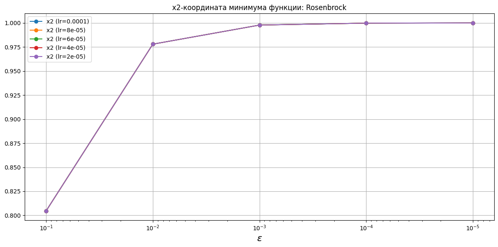
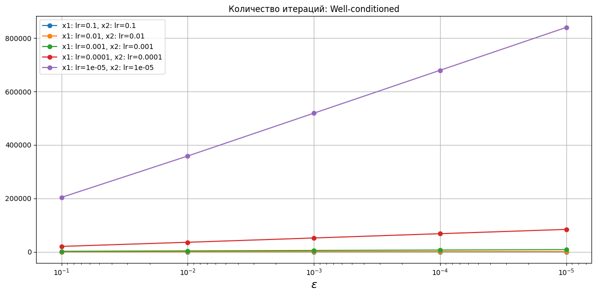
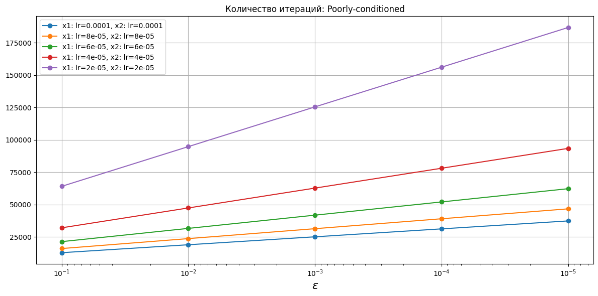
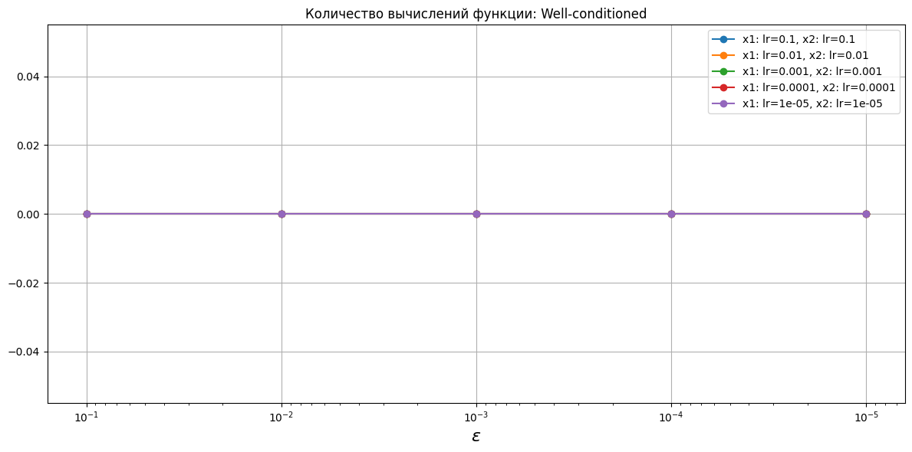
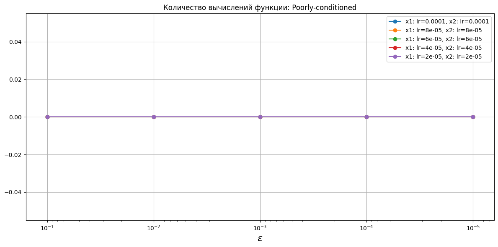
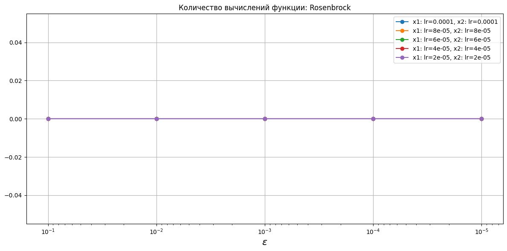
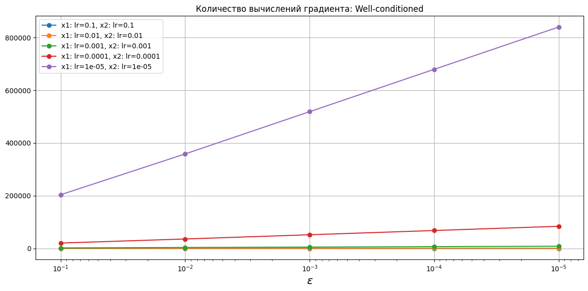

# Градиентный спуск с постоянным шагом

## Критерий останова

$$\begin{equation}
    \|\nabla f(x_k)\| < \varepsilon.
\end{equation}$$

## Координаты минимума функции

## Количество итераций

## Количество вычислений функции

## Количество вычислений градиента

# Приложение с таблицами

<!-- START_X_OPTIM_WELL-CONDITIONED --> 
## Координаты минимума функции: Well-conditioned
|    eps |   x1 (lr=0.1) |   x2 (lr=0.1) |   x1 (lr=0.01) |   x2 (lr=0.01) |   x1 (lr=0.001) |   x2 (lr=0.001) |   x1 (lr=0.0001) |   x2 (lr=0.0001) |   x1 (lr=1e-05) |   x2 (lr=1e-05) |
|-------:|--------------:|--------------:|---------------:|---------------:|----------------:|----------------:|-----------------:|-----------------:|----------------:|----------------:|
| 0.1    |  -0.0526575   |   0.0135367   |   -0.0632138   |    0.0106897   |    -0.0648736   |     0.010308    |     -0.0650507   |      0.0102681   |    -0.0650584   |     0.0102642   |
| 0.01   |  -0.0049103   |   0.001937    |   -0.00643387  |    0.00237453  |    -0.00651684  |     0.00238807  |     -0.00653269  |      0.00239187  |    -0.00653437  |     0.00239228  |
| 0.001  |  -0.000478479 |   0.000197058 |   -0.00062909  |    0.000256038 |    -0.000644504 |     0.000261883 |     -0.000645769 |      0.000262354 |    -0.000645877 |     0.000262394 |
| 0.0001 |  -5.47291e-05 |   2.26517e-05 |   -6.31211e-05 |    2.60728e-05 |    -6.43188e-05 |     2.65593e-05 |     -6.44287e-05 |      2.66038e-05 |    -6.44407e-05 |     2.66086e-05 |
| 1e-05  |  -5.36545e-06 |   2.22223e-06 |   -6.34482e-06 |    2.62694e-06 |    -6.43132e-06 |     2.6626e-06  |     -6.44078e-06 |      2.6665e-06  |    -6.44163e-06 |     2.66685e-06 |
<!-- END_X_OPTIM_WELL-CONDITIONED -->
<!-- START_X_OPTIM_POORLY-CONDITIONED --> 
## Координаты минимума функции: Poorly-conditioned
|    eps |   x1 (lr=0.0001) |   x2 (lr=0.0001) |   x1 (lr=8e-05) |   x2 (lr=8e-05) |   x1 (lr=6e-05) |   x2 (lr=6e-05) |   x1 (lr=4e-05) |   x2 (lr=4e-05) |   x1 (lr=2e-05) |   x2 (lr=2e-05) |
|-------:|-----------------:|-----------------:|----------------:|----------------:|----------------:|----------------:|----------------:|----------------:|----------------:|----------------:|
| 0.1    |         -5.49287 |        -0.207137 |        -5.49286 |       -0.207137 |        -5.49286 |       -0.207137 |        -5.49286 |       -0.207137 |        -5.49285 |       -0.207137 |
| 0.01   |         -5.51682 |        -0.207727 |        -5.51682 |       -0.207727 |        -5.51682 |       -0.207727 |        -5.51682 |       -0.207727 |        -5.51682 |       -0.207727 |
| 0.001  |         -5.51921 |        -0.207786 |        -5.51921 |       -0.207786 |        -5.51921 |       -0.207786 |        -5.51921 |       -0.207786 |        -5.51921 |       -0.207786 |
| 0.0001 |         -5.51945 |        -0.207792 |        -5.51945 |       -0.207792 |        -5.51945 |       -0.207792 |        -5.51945 |       -0.207792 |        -5.51945 |       -0.207792 |
| 1e-05  |         -5.51948 |        -0.207792 |        -5.51948 |       -0.207792 |        -5.51948 |       -0.207792 |        -5.51948 |       -0.207792 |        -5.51948 |       -0.207792 |
<!-- END_X_OPTIM_POORLY-CONDITIONED -->
<!-- START_X_OPTIM_ROSENBROCK --> 
## Координаты минимума функции: Rosenbrock
|    eps |   x1 (lr=0.0001) |   x2 (lr=0.0001) |   x1 (lr=8e-05) |   x2 (lr=8e-05) |   x1 (lr=6e-05) |   x2 (lr=6e-05) |   x1 (lr=4e-05) |   x2 (lr=4e-05) |   x1 (lr=2e-05) |   x2 (lr=2e-05) |
|-------:|-----------------:|-----------------:|----------------:|----------------:|----------------:|----------------:|----------------:|----------------:|----------------:|----------------:|
| 0.1    |         0.897287 |         0.804687 |        0.897286 |        0.804686 |        0.897285 |        0.804684 |        0.897285 |        0.804683 |        0.897283 |        0.80468  |
| 0.01   |         0.988919 |         0.977917 |        0.988919 |        0.977917 |        0.988919 |        0.977916 |        0.988919 |        0.977916 |        0.988919 |        0.977916 |
| 0.001  |         0.998883 |         0.997763 |        0.998883 |        0.997763 |        0.998883 |        0.997763 |        0.998883 |        0.997763 |        0.998883 |        0.997763 |
| 0.0001 |         0.999888 |         0.999776 |        0.999888 |        0.999776 |        0.999888 |        0.999776 |        0.999888 |        0.999776 |        0.999888 |        0.999776 |
| 1e-05  |         0.999989 |         0.999978 |        0.999989 |        0.999978 |        0.999989 |        0.999978 |        0.999989 |        0.999978 |        0.999989 |        0.999978 |
<!-- END_X_OPTIM_ROSENBROCK -->
<!-- START_ITER_COUNTER_WELL-CONDITIONED --> 
## Количество итераций: Well-conditioned
|    eps |   x1: lr=0.1, x2: lr=0.1 |   x1: lr=0.01, x2: lr=0.01 |   x1: lr=0.001, x2: lr=0.001 |   x1: lr=0.0001, x2: lr=0.0001 |   x1: lr=1e-05, x2: lr=1e-05 |
|-------:|-------------------------:|---------------------------:|-----------------------------:|-------------------------------:|-----------------------------:|
| 0.1    |                       20 |                        204 |                         2038 |                          20377 |                       203777 |
| 0.01   |                       35 |                        357 |                         3585 |                          35857 |                       358576 |
| 0.001  |                       50 |                        517 |                         5187 |                          51890 |                       518922 |
| 0.0001 |                       64 |                        676 |                         6791 |                          67942 |                       679451 |
| 1e-05  |                       79 |                        835 |                         8395 |                          83994 |                       839985 |
<!-- END_ITER_COUNTER_WELL-CONDITIONED -->
<!-- START_ITER_COUNTER_POORLY-CONDITIONED --> 
## Количество итераций: Poorly-conditioned
|    eps |   x1: lr=0.0001, x2: lr=0.0001 |   x1: lr=8e-05, x2: lr=8e-05 |   x1: lr=6e-05, x2: lr=6e-05 |   x1: lr=4e-05, x2: lr=4e-05 |   x1: lr=2e-05, x2: lr=2e-05 |
|-------:|-------------------------------:|-----------------------------:|-----------------------------:|-----------------------------:|-----------------------------:|
| 0.1    |                          12813 |                        16016 |                        21355 |                        32033 |                        64067 |
| 0.01   |                          18945 |                        23682 |                        31577 |                        47367 |                        94735 |
| 0.001  |                          25078 |                        31349 |                        41799 |                        62700 |                       125404 |
| 0.0001 |                          31211 |                        39015 |                        52021 |                        78034 |                       156072 |
| 1e-05  |                          37344 |                        46681 |                        62243 |                        93368 |                       186741 |
<!-- END_ITER_COUNTER_POORLY-CONDITIONED -->
<!-- START_ITER_COUNTER_ROSENBROCK --> 
## Количество итераций: Rosenbrock
|    eps |   x1: lr=0.0001, x2: lr=0.0001 |   x1: lr=8e-05, x2: lr=8e-05 |   x1: lr=6e-05, x2: lr=6e-05 |   x1: lr=4e-05, x2: lr=4e-05 |   x1: lr=2e-05, x2: lr=2e-05 |
|-------:|-------------------------------:|-----------------------------:|-----------------------------:|-----------------------------:|-----------------------------:|
| 0.1    |                          31161 |                        38957 |                        51950 |                        77936 |              155892          |
| 0.01   |                          83357 |                       104202 |                       138944 |                       208427 |              416875          |
| 0.001  |                         140415 |                       175525 |                       234041 |                       351073 |              702169          |
| 0.0001 |                         198010 |                       247519 |                       330034 |                       495063 |              990150          |
| 1e-05  |                         255660 |                       319581 |                       426117 |                       639189 |                   1.2784e+06 |
<!-- END_ITER_COUNTER_ROSENBROCK -->
<!-- START_FUNC_COUNTER_WELL-CONDITIONED --> 
## Количество вычислений функции: Well-conditioned
|    eps |   x1: lr=0.1, x2: lr=0.1 |   x1: lr=0.01, x2: lr=0.01 |   x1: lr=0.001, x2: lr=0.001 |   x1: lr=0.0001, x2: lr=0.0001 |   x1: lr=1e-05, x2: lr=1e-05 |
|-------:|-------------------------:|---------------------------:|-----------------------------:|-------------------------------:|-----------------------------:|
| 0.1    |                        0 |                          0 |                            0 |                              0 |                            0 |
| 0.01   |                        0 |                          0 |                            0 |                              0 |                            0 |
| 0.001  |                        0 |                          0 |                            0 |                              0 |                            0 |
| 0.0001 |                        0 |                          0 |                            0 |                              0 |                            0 |
| 1e-05  |                        0 |                          0 |                            0 |                              0 |                            0 |
<!-- END_FUNC_COUNTER_WELL-CONDITIONED -->
<!-- START_FUNC_COUNTER_POORLY-CONDITIONED --> 
## Количество вычислений функции: Poorly-conditioned
|    eps |   x1: lr=0.0001, x2: lr=0.0001 |   x1: lr=8e-05, x2: lr=8e-05 |   x1: lr=6e-05, x2: lr=6e-05 |   x1: lr=4e-05, x2: lr=4e-05 |   x1: lr=2e-05, x2: lr=2e-05 |
|-------:|-------------------------------:|-----------------------------:|-----------------------------:|-----------------------------:|-----------------------------:|
| 0.1    |                              0 |                            0 |                            0 |                            0 |                            0 |
| 0.01   |                              0 |                            0 |                            0 |                            0 |                            0 |
| 0.001  |                              0 |                            0 |                            0 |                            0 |                            0 |
| 0.0001 |                              0 |                            0 |                            0 |                            0 |                            0 |
| 1e-05  |                              0 |                            0 |                            0 |                            0 |                            0 |
<!-- END_FUNC_COUNTER_POORLY-CONDITIONED -->
<!-- START_FUNC_COUNTER_ROSENBROCK --> 
## Количество вычислений функции: Rosenbrock
|    eps |   x1: lr=0.0001, x2: lr=0.0001 |   x1: lr=8e-05, x2: lr=8e-05 |   x1: lr=6e-05, x2: lr=6e-05 |   x1: lr=4e-05, x2: lr=4e-05 |   x1: lr=2e-05, x2: lr=2e-05 |
|-------:|-------------------------------:|-----------------------------:|-----------------------------:|-----------------------------:|-----------------------------:|
| 0.1    |                              0 |                            0 |                            0 |                            0 |                            0 |
| 0.01   |                              0 |                            0 |                            0 |                            0 |                            0 |
| 0.001  |                              0 |                            0 |                            0 |                            0 |                            0 |
| 0.0001 |                              0 |                            0 |                            0 |                            0 |                            0 |
| 1e-05  |                              0 |                            0 |                            0 |                            0 |                            0 |
<!-- END_FUNC_COUNTER_ROSENBROCK -->
<!-- START_GRAD_COUNTER_WELL-CONDITIONED --> 
## Количество вычислений градиента: Well-conditioned
|    eps |   x1: lr=0.1, x2: lr=0.1 |   x1: lr=0.01, x2: lr=0.01 |   x1: lr=0.001, x2: lr=0.001 |   x1: lr=0.0001, x2: lr=0.0001 |   x1: lr=1e-05, x2: lr=1e-05 |
|-------:|-------------------------:|---------------------------:|-----------------------------:|-------------------------------:|-----------------------------:|
| 0.1    |                       20 |                        204 |                         2038 |                          20377 |                       203777 |
| 0.01   |                       35 |                        357 |                         3585 |                          35857 |                       358576 |
| 0.001  |                       50 |                        517 |                         5187 |                          51890 |                       518922 |
| 0.0001 |                       64 |                        676 |                         6791 |                          67942 |                       679451 |
| 1e-05  |                       79 |                        835 |                         8395 |                          83994 |                       839985 |
<!-- END_GRAD_COUNTER_WELL-CONDITIONED -->
<!-- START_GRAD_COUNTER_POORLY-CONDITIONED --> 
## Количество вычислений градиента: Poorly-conditioned
|    eps |   x1: lr=0.0001, x2: lr=0.0001 |   x1: lr=8e-05, x2: lr=8e-05 |   x1: lr=6e-05, x2: lr=6e-05 |   x1: lr=4e-05, x2: lr=4e-05 |   x1: lr=2e-05, x2: lr=2e-05 |
|-------:|-------------------------------:|-----------------------------:|-----------------------------:|-----------------------------:|-----------------------------:|
| 0.1    |                          12813 |                        16016 |                        21355 |                        32033 |                        64067 |
| 0.01   |                          18945 |                        23682 |                        31577 |                        47367 |                        94735 |
| 0.001  |                          25078 |                        31349 |                        41799 |                        62700 |                       125404 |
| 0.0001 |                          31211 |                        39015 |                        52021 |                        78034 |                       156072 |
| 1e-05  |                          37344 |                        46681 |                        62243 |                        93368 |                       186741 |
<!-- END_GRAD_COUNTER_POORLY-CONDITIONED -->
<!-- START_GRAD_COUNTER_ROSENBROCK --> 
## Количество вычислений градиента: Rosenbrock
|    eps |   x1: lr=0.0001, x2: lr=0.0001 |   x1: lr=8e-05, x2: lr=8e-05 |   x1: lr=6e-05, x2: lr=6e-05 |   x1: lr=4e-05, x2: lr=4e-05 |   x1: lr=2e-05, x2: lr=2e-05 |
|-------:|-------------------------------:|-----------------------------:|-----------------------------:|-----------------------------:|-----------------------------:|
| 0.1    |                          31161 |                        38957 |                        51950 |                        77936 |              155892          |
| 0.01   |                          83357 |                       104202 |                       138944 |                       208427 |              416875          |
| 0.001  |                         140415 |                       175525 |                       234041 |                       351073 |              702169          |
| 0.0001 |                         198010 |                       247519 |                       330034 |                       495063 |              990150          |
| 1e-05  |                         255660 |                       319581 |                       426117 |                       639189 |                   1.2784e+06 |
<!-- END_GRAD_COUNTER_ROSENBROCK -->