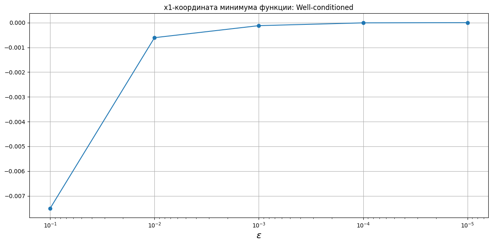
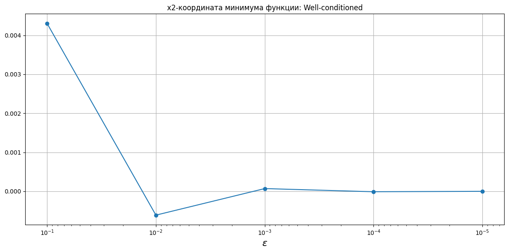
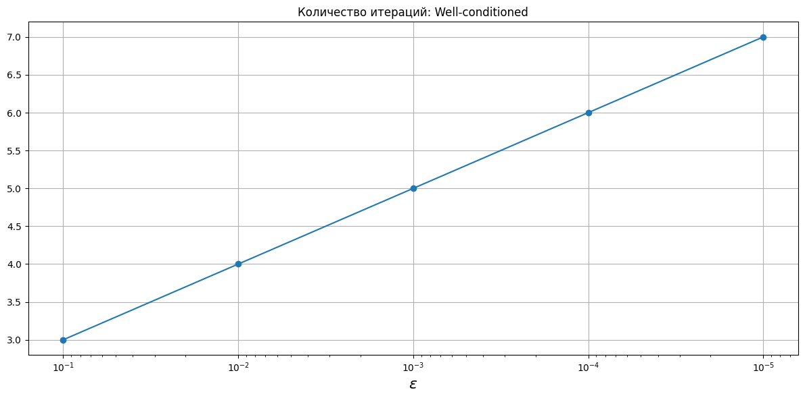

# Наискорейший спуск с одномерным поиском методом золотого сечения
Расчеты представлены в [steepest_descent.ipynb](steepest_descent.ipynb).

## Критерий останова

$$\begin{equation}
    \|\nabla f(x_k)\| < \varepsilon.
\end{equation}$$

## Координаты минимума функции

## Количество итераций

## Количество вычислений функции

## Количество вычислений градиента

## Приложение с таблицами

<!-- START_X_OPTIM --> 
### Координаты минимума функции
|    eps |   Well-conditioned (x1) |   Well-conditioned (x2) |   Poorly-conditioned (x1) |   Poorly-conditioned (x2) |   Rosenbrock (x1) |   Rosenbrock (x2) |
|-------:|------------------------:|------------------------:|--------------------------:|--------------------------:|------------------:|------------------:|
| 0.1    |            -0.0075024   |             0.00430414  |                  -5.49864 |                 -0.207143 |          0.917361 |          0.841071 |
| 0.01   |            -0.000608827 |            -0.000609488 |                  -5.51731 |                 -0.207726 |          0.991507 |          0.983039 |
| 0.001  |            -0.000123149 |             7.09462e-05 |                  -5.51926 |                 -0.207785 |          0.99901  |          0.998015 |
| 0.0001 |            -1.01842e-05 |            -1.01046e-05 |                  -5.51946 |                 -0.207792 |          0.999901 |          0.999802 |
| 1e-05  |            -2.07444e-06 |             1.19065e-06 |                  -5.51948 |                 -0.207792 |          0.99999  |          0.99998  |
<!-- END_X_OPTIM -->
<!-- START_ITER_COUNT --> 
### Количество итераций
|    eps |   Well-conditioned |   Poorly-conditioned |   Rosenbrock |
|-------:|-------------------:|---------------------:|-------------:|
| 0.1    |                  3 |                  245 |         1028 |
| 0.01   |                  4 |                  355 |         3548 |
| 0.001  |                  5 |                  465 |         6128 |
| 0.0001 |                  6 |                  577 |         8775 |
| 1e-05  |                  7 |                  659 |        11290 |
<!-- END_ITER_COUNT -->
<!-- START_FUNC_COUNT --> 
### Количество вычислений функции
|    eps |   Well-conditioned |   Poorly-conditioned |   Rosenbrock |
|-------:|-------------------:|---------------------:|-------------:|
| 0.1    |                 51 |                 4165 |        17476 |
| 0.01   |                 68 |                 6035 |        60316 |
| 0.001  |                 85 |                 7905 |       104176 |
| 0.0001 |                102 |                 9809 |       149175 |
| 1e-05  |                119 |                11203 |       191930 |
<!-- END_FUNC_COUNT -->
<!-- START_GRAD_COUNT --> 
### Количество вычислений градиента
|    eps |   Well-conditioned |   Poorly-conditioned |   Rosenbrock |
|-------:|-------------------:|---------------------:|-------------:|
| 0.1    |                  4 |                  246 |         1029 |
| 0.01   |                  5 |                  356 |         3549 |
| 0.001  |                  6 |                  466 |         6129 |
| 0.0001 |                  7 |                  578 |         8776 |
| 1e-05  |                  8 |                  660 |        11291 |
<!-- END_GRAD_COUNT -->