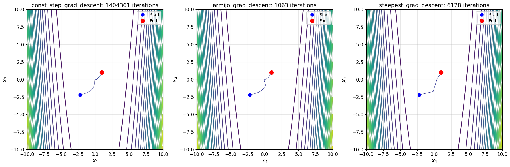
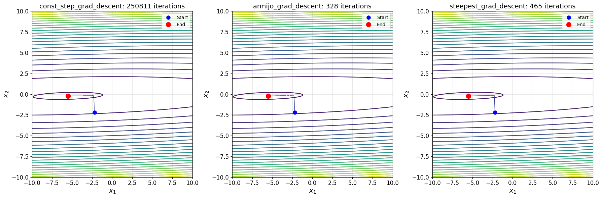

# Траектории методов на графике линий уровня
## Критерий останова

$$\begin{equation}
    \|\nabla f(x_k)\| < 1e-5.
\end{equation}$$

## Функция Розенброка

## Хорошо обусловленная (µ ≃ 1) двумерная квадратичная функция

## Плохо обусловленная (µ > 10) двумерная квадратичная функция
